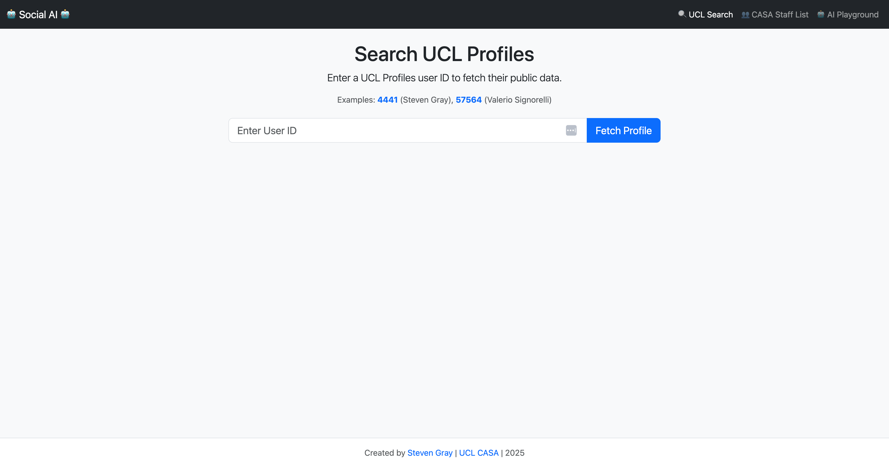
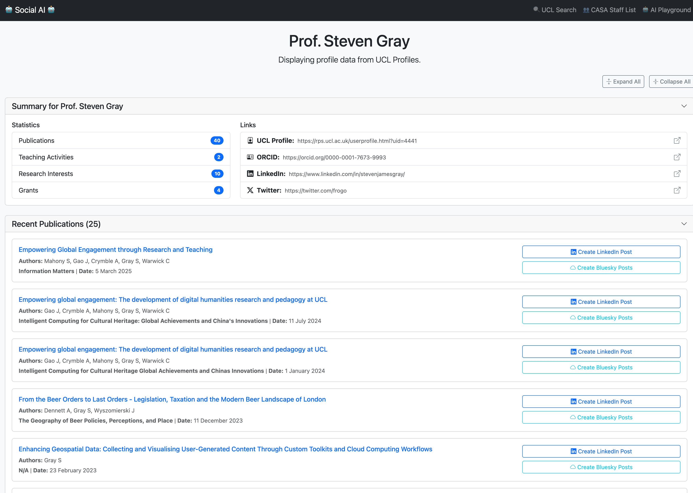
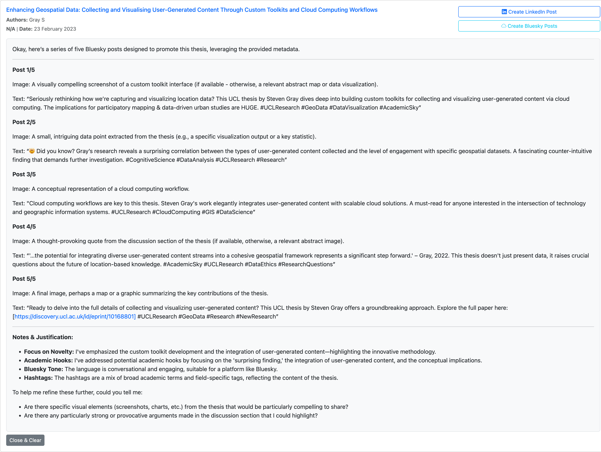

# UCL CASA 🤖 Social AI

A fun little web application that fetches public data from UCL Profiles and uses a local Large Language Model (LLM) to generate social media content. 🚀

## 🖼️ Screenshots

<p align="center">
  
  &nbsp; &nbsp;
  
</p>
<p align="center">
  <em><b>Left:</b> The main page for the interface. <b>Right:</b> Loaded Profile of user from UCL Profiles.</em>
</p>
<br>
<p align="center">
  
</p>
<p align="center">
  <em>A generated social post from a research paper, showing the AI-written text.</em>
</p>


## ✨ What it does

This application allows you to:

*   **🔍 Search for Profiles**: Enter a UCL Profiles ID to fetch detailed information about a person.
*   **📊 View Rich Data**: See a summary, recent publications, and awarded grants for any profile.
*   **🤖 Generate AI Content**: For any publication or grant, you can automatically generate engaging posts for LinkedIn or Bluesky using a connected LLM (like Ollama via Open WebUI).
*   **👥 Browse Staff**: View a list of staff from the UCL Centre for Advanced Spatial Analysis (CASA).

## 🛠️ Tech Stack

*   **Backend**: Node.js with Express.js
*   **Frontend**: EJS (Embedded JavaScript) for templating, Bootstrap for styling.
*   **AI Integration**: Connects to any OpenAI-compatible API endpoint, like Open WebUI.
*   **Containerization**: Docker

## ⚙️ Getting Started

Follow these steps to get the application running on your local machine.

### 1. Prerequisites

*   [Node.js](https://nodejs.org/) (v20 or later recommended)
*   [Docker](https://www.docker.com/products/docker-desktop/) (if you want to run it in a container)
*   An LLM running with an OpenAI-compatible API. We recommend [Ollama](https://ollama.com/) + [Open WebUI](https://github.com/open-webui/open-webui).

### 2. Installation

1.  **Clone the repository:**
    ```bash
    git clone <your-repo-url>
    cd casa-social-ai
    ```

2.  **Install dependencies:**
    ```bash
    npm install
    ```

### 3. Environment Variables

Create a `.env` file in the root of the project by copying the example file:

```bash
cp .env.example .env
```

Now, open the `.env` file and fill in the required values.

### 4. Running the App

To start the application in development mode with live reloading, run:

```bash
npm start
```
*(Note: This uses `nodemon`, which is included as a dev dependency. If this script fails, you can add `"start": "nodemon server.js"` to your `package.json` scripts.)*

Or, to run it directly without live-reloading:

```bash
node server.js
```

The application will be available at `http://localhost:3000`.

## 🐳 Running with Docker

You can also run the entire application inside a Docker container.

1.  **Build the Docker image:**
    ```bash
    docker build -t casa-social-ai .
    ```

2.  **Run the container:**
    This command passes your local `.env` file into the container at runtime so you don't have to hardcode secrets in the image.
    ```bash
    docker run -p 3000:3000 --env-file .env casa-social-ai
    ```

The application will be running at `http://localhost:3000`.
